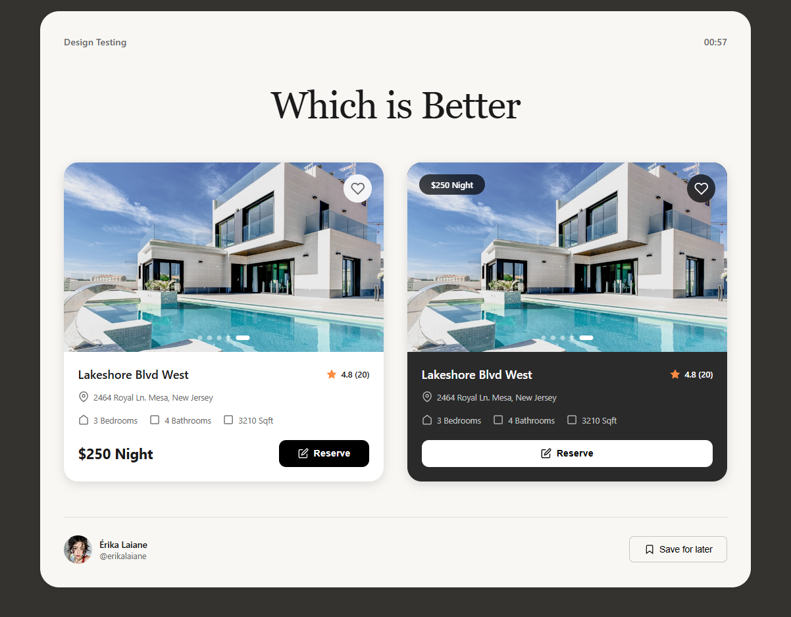

# Card Layout

<div align="center">
  
  
  <p align="center">
    Um projeto de design testing focado em criar cards modernos e responsivos para listagem de propriedades/produtos
  </p>

  
  
  
</div>

## Sobre o Projeto

**Card Layout** é um projeto experimental para testar e comparar diferentes abordagens de design para cards de conteúdo. O objetivo é explorar variações de contraste, hierarquia visual e experiência do usuário através de dois estilos distintos: claro (Card A) e escuro (Card B).

## Características

- **Design Moderno**: Interface clean e contemporânea
- **Dois Estilos**: Comparação A/B entre cards claro e escuro
- **Totalmente Responsivo**: Adaptável a todos os tamanhos de tela
- **Animações Suaves**: Transições e efeitos visuais elegantes
- **Sistema de Favoritos**: Interação com ícone de coração
- **Carrossel de Imagens**: Indicadores animados automaticamente
- **Timer Integrado**: Contador de tempo de visualização
- **Save Feature**: Função de salvar para depois
- **Efeito Parallax**: Movimento suave no scroll

## Tecnologias Utilizadas

- **HTML5**: Estrutura semântica e acessível
- **CSS3**: Flexbox, Grid, Animations e Transitions
- **JavaScript (Vanilla)**: Interatividade sem dependências

## Comparação dos Estilos

### Card A (Estilo Claro)
- ✅ Background branco limpo
- ✅ Preço posicionado no rodapé
- ✅ Botão de reserva escuro e destacado
- ✅ Melhor legibilidade em ambientes claros

### Card B (Estilo Escuro)
- ✅ Background escuro sofisticado
- ✅ Badge de preço flutuante na imagem
- ✅ Botão de reserva claro full-width
- ✅ Visual mais premium e moderno

## Como Usar

1. **Clone o repositório**
```bash
git clone https://github.com/seu-usuario/card-layout.git
```

2. **Navegue até a pasta**
```bash
cd card-layout
```

3. **Abra no navegador**
```bash
# Basta abrir o arquivo index.html no seu navegador preferido
```

## Estrutura de Arquivos

```
card-layout/
│
├── index.html          # Estrutura HTML
├── style.css           # Estilos e layout
├── script.js           # Funcionalidades JavaScript
├── site-bg.png         # Preview do projeto
└── README.md           # Documentação
```

## Funcionalidades Interativas

### Timer
- Contador automático que inicia ao carregar a página
- Formato: MM:SS

### Sistema de Favoritos
- Clique no ícone de coração para favoritar
- Animação de escala ao clicar
- Estado visual ativo com cor vermelha

### Carrossel de Dots
- Troca automática a cada 3 segundos
- Indicador visual do slide atual

### Botão de Reserva
- Feedback visual ao clicar
- Mensagem de "Reserved!" temporária
- Retorno ao estado original após 2 segundos

### Botão Save
- Toggle de estado salvo/não salvo
- Mudança de ícone e cor ao ativar

### Efeitos Visuais
- Animação de entrada dos cards ao carregar
- Efeito parallax nas imagens durante o scroll
- Hover effects em todos os elementos interativos

## Aprendizados

Este projeto explora:
- Design de interfaces card-based
- Testes A/B de UI/UX
- Hierarquia visual e contraste
- Responsividade e adaptabilidade
- Microinterações e feedback ao usuário
- Performance de animações CSS e JS

## Roadmap

- [ ] Adicionar mais variações de design (Card C, D, E...)
- [ ] Implementar sistema de votação em tempo real
- [ ] Criar dashboard com estatísticas de preferência
- [ ] Adicionar tema dark mode global
- [ ] Integrar com API de propriedades reais
- [ ] Criar versão mobile-first dedicada

## Licença

Este projeto está sob a licença MIT. Veja o arquivo `LICENSE` para mais detalhes.

## Autora

Feito com 💜 por [Érika Laiane](https://github.com/erikalaiane)

---

<div align="center">
  <p>Feito com ❤️ para estudos de UI/UX Design</p>
</div>